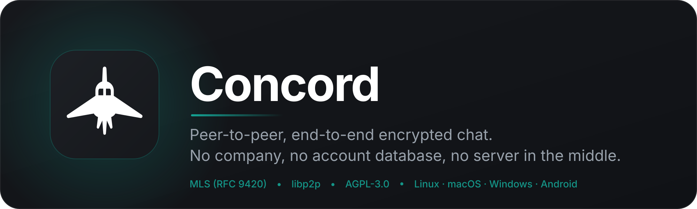
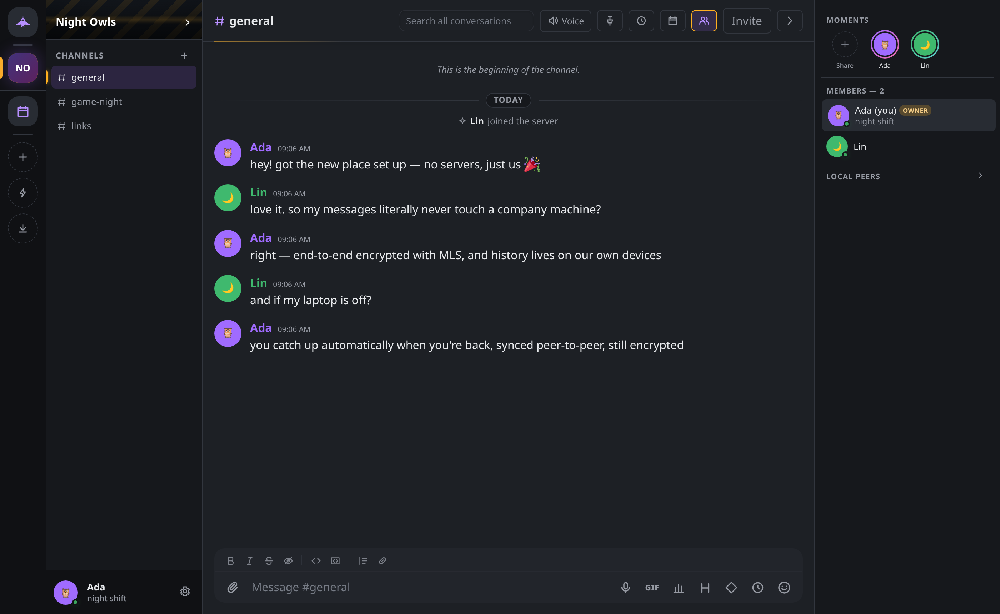
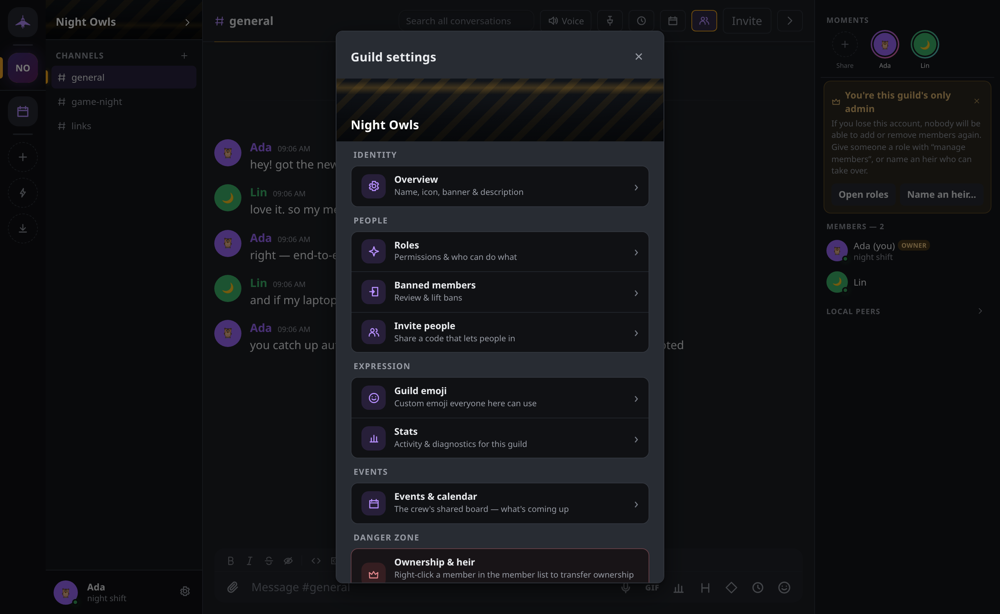
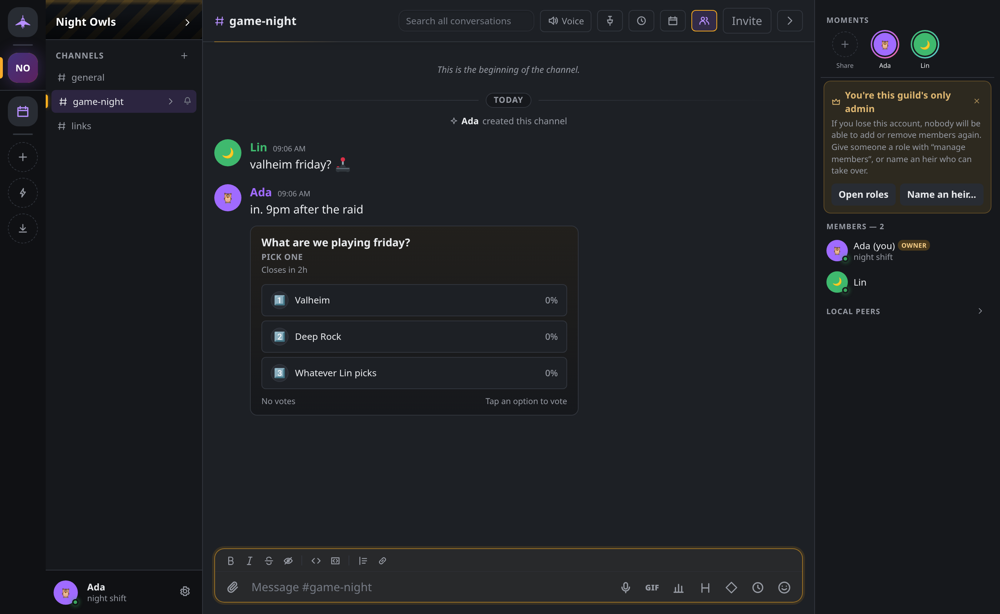
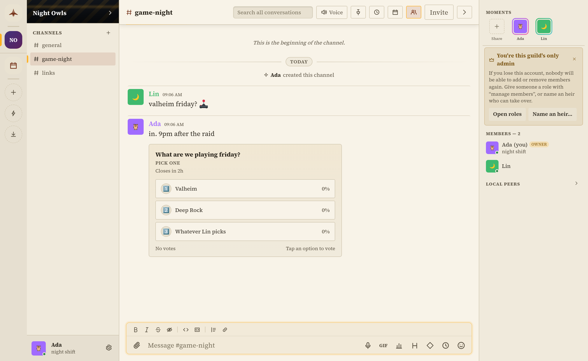
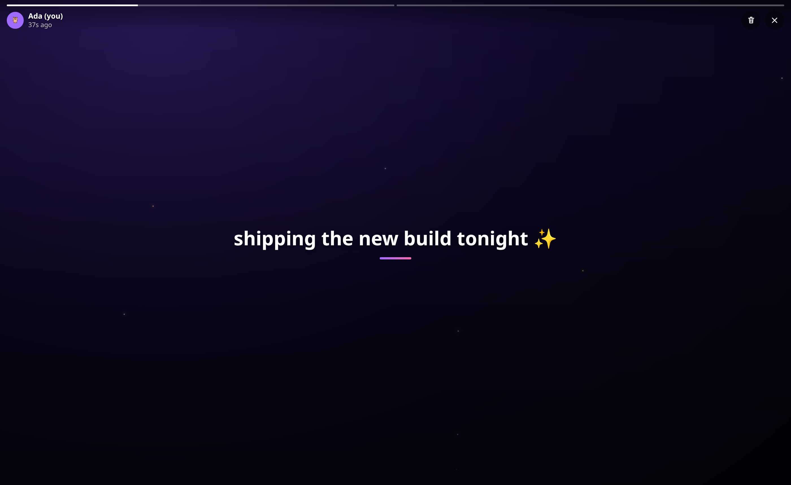

<p align="center">
  <picture>
    <source media="(prefers-color-scheme: dark)" srcset="docs/media/banner.png">
    <source media="(prefers-color-scheme: light)" srcset="docs/media/banner-light.png">
    
  </picture>
</p>

<p align="center">
  <a href="https://github.com/ZahakJ/concord/actions/workflows/ci.yml"></a>
  <a href="https://github.com/ZahakJ/concord/releases/latest"></a>
  <a href="LICENSE"></a>
  <a href="go.mod"></a>
  <a href="SECURITY.md"></a>
</p>

A peer-to-peer, end-to-end-encrypted alternative to Discord: guilds, channels,
direct messages, voice, video and screen sharing, with nobody in the middle.
There is no company, no account database, and no server that stores your
messages. Every guild is a cryptographic group, every message is end-to-end
encrypted, and the one piece of infrastructure Concord can use is untrusted by
construction.


> Two devices, two identities, one conversation. Alice types and Bob's screen
> shows she is typing; she sends and it lands. The delay you see is the delay
> the app had — these are two separate Concord instances, each with its own
> keypair and database, and there is no server between them to go through.

| | |
|---|---|
|  |  |
| *A channel, its members, and the moments row* | *Guild settings: roles, bans, invites, emoji, events, ownership* |
|  |  |
| *A poll in a channel* | *The same view in one of the light themes* |



> Moments: text over a drawn preset background, gone after a day. Nothing is
> uploaded anywhere.

## What makes it different

- **No account.** Your identity is an Ed25519 keypair on your device. No signup,
  no email, no phone number, no username table, nothing to breach.
- **No message store.** History lives on the devices of the people in the
  conversation and nowhere else.
- **End-to-end encrypted with MLS** (RFC 9420, the IETF group-messaging
  standard). A guild is one cryptographic group; removing a member is a rekey
  rather than a flag.
- **One optional node.** A rendezvous you host yourself helps peers find and
  reach each other. It cannot read what it carries, and the app is built to
  degrade rather than stop when it is gone.
- **Nothing is fetched at runtime, by default.** Emoji, typefaces, icons and
  sounds are in the binary, so no CDN learns your IP address and the moment you
  opened the app. The handful of features that *could* reach a third party —
  link previews, YouTube embeds, game box art — ship switched off and say so
  where they sit. [PRIVACY.md](PRIVACY.md) names every outbound call the app can
  make and what triggers it.
- **Self-contained, not minimal.** Concord ships stories, a soundboard, a meme
  editor, polls, events, calendars, more than twenty themes and a game
  collection for your profile. The soundboard synthesizes its sounds from
  oscillators instead of shipping audio files; story backgrounds are drawn
  presets rather than downloaded images.

The trade is stated up front: Concord is built for friend groups and
communities, not million-user servers. A full mesh of live audio does not scale
to stadiums, and metadata (who connects to whom, and when) is not hidden the way
message content is. [DESIGN.md](docs/DESIGN.md) says where the limits are and
why.

## Install

Downloads are on the [releases
page](https://github.com/ZahakJ/concord/releases):

- **Web build**: one self-contained file per OS. Run it and your browser opens
  on the app. No dependencies, no installer, no admin rights.
- **Desktop app**: a native window for Linux, Windows (with a one-click
  installer) and macOS.
- **Android**: a sideloadable APK.

Windows flags unsigned executables. [WINDOWS.md](WINDOWS.md) covers the bypass
and the web-build fallback.

## Build from source

```sh
git clone https://github.com/ZahakJ/concord && cd concord
make web            # builds the Svelte UI into the Go binary
./bin/concord-web   # then open http://127.0.0.1:8787
```

Unlock with a passphrase (the first unlock creates your identity), then create a
guild and share its invite code. `make gui` builds the native desktop window
instead, and needs `webkit2gtk-4.1`. `make help` lists every target.

> **Before you invite someone:** two peers on different networks usually cannot
> reach each other without help, because home routers refuse incoming
> connections. On the same Wi-Fi it just works; on a Tailscale or WireGuard mesh
> it just works; otherwise somebody has to run a
> [rendezvous](docs/RENDEZVOUS.md) — one small always-on node, and only one
> person in the group needs to. **Can people reach me?** in the app (Ctrl+K)
> tells you which of those you are in. The table below explains the trade in
> each case.

To run several isolated peers side by side, which is how most development
happens: `make peers` starts two on `:8801` and `:8802`, and they find each
other over mDNS.

## How it works

Removing the server means answering the questions a server answers for free.
*Discovery*: peers advertise under a computed key on a distributed hash table,
and fall back to mDNS on the LAN, to remembered addresses from past sessions,
and to invite codes pasted by hand. *Reachability*: two peers behind home routers
punch a hole through their NATs, and fall back to a circuit relay that forwards
ciphertext it is not an endpoint of. *Trust*: a peer's network address is derived
from its public key, so dialling the right address and completing the handshake
is the identity check, with out-of-band fingerprint comparison closing the
first-contact gap. *Membership*: MLS holds one ratchet tree per guild, and a
signed, replayable governance log decides who may change it.

[DESIGN.md](docs/DESIGN.md) is the long-form version: fourteen sections that
define each term on first use, explain each mechanism precisely enough to argue
with, and state the cost beside every benefit. Start with
[§6, the rendezvous node](docs/DESIGN.md#6-the-rendezvous-node), if you want to
know what the one server can and cannot see, or
[§13, the threat model](docs/DESIGN.md#13-threat-model-what-concord-defends-against),
for the known gaps. [PRIVACY.md](PRIVACY.md) is the plain-language summary of
what data exists and who can read it.

## Finding each other

Two people can only talk if at least one of them can accept an incoming
connection, and home routers usually refuse. Which of these three you are in
decides what, if anything, you have to set up:

| Where you both are | What it takes | What it costs |
|---|---|---|
| The same Wi-Fi | Nothing. Concord asks the local network and dials whatever answers. | Nothing, but in practice this is desktop to desktop: Android's sandbox refuses the socket that mDNS needs, and many workplace networks drop the packets. |
| Different networks, one side can forward a port | That side pins a port and adds one rule in its router. The invite code carries its own address, so the other side dials it directly. No server is involved. | The forwarding side's IP address is inside every invite code it hands out, whether or not the router rule works. |
| Different networks, neither can forward | Somebody runs a rendezvous: a small always-on node that introduces the two and carries their traffic when neither can be dialled. **[How to run one](docs/RENDEZVOUS.md)** — Docker, a VPS, or fly.io, in about five minutes. | One machine has to exist somewhere. It does not have to be yours; a friend's works, and their invite code points your client at it automatically. |

Inside the app, **Can people reach me?** (in the Ctrl+K palette, and beside every
invite code) reports which of the three you are actually in and offers the one
thing to do about it.

There is a fourth rung, off by default: bootstrapping off the public IPFS DHT so
two people who have never met can find each other with no Concord server alive.
It solves finding, not reaching, and it costs metadata.
[§4.6 of DESIGN.md](docs/DESIGN.md#46-the-ladder-concord-climbs) walks all four
rungs and states the price of each.

## What is in it

Guilds with channels, categories, roles and permissions; replies, edits,
deletes, reactions, pins, mentions and Markdown; encrypted attachments; per-guild
GIF packs and custom emoji; local full-history search and Markdown export.
Direct messages with an encrypted offline mailbox, so a DM lands even when the
recipient is away, and message requests that disclose nothing to a stranger until
you accept. Voice and video over a WebRTC mesh with tuned Opus, push-to-talk,
camera and screen sharing. Meeting rooms that browser guests can join with no
install, scoped to one channel behind a lockable door. Multi-device linking by QR
code. Browser, native desktop and Android front ends over one Go core.

Work in progress: an optional SFU for larger voice rooms, onion-routed metadata
privacy, and iOS distribution to match Android. Known gaps are enumerated in
[§13](docs/DESIGN.md#13-threat-model-what-concord-defends-against) rather than
left for you to find.

## Meme templates

The meme editor takes an optional starter pack in `frontend/public/memes/`: 101
WebP templates and a `manifest.json` giving each one a label, search tags and
caption-box placements. **The images are not in this repository.** They are
third-party photographs and artwork with identifiable rightsholders, several of
them commercial, and Concord holds no licence to redistribute them — so the pack
is built rather than checked in. `node frontend/scripts/prep-memes.mjs` fetches
and re-encodes it; releases ship without it.

Nothing depends on the pack. The editor reads the manifest at runtime and falls
back to bring-your-own images when the directory is absent, so paste, upload and
"Make a meme" on any picture in the conversation all work with no pack at all.
The full position is in
[frontend/public/memes/README.md](frontend/public/memes/README.md), which is
tracked even though the images it describes are not.

## Documentation

| | |
|---|---|
| [docs/DESIGN.md](docs/DESIGN.md) | How Concord works, end to end, and what it costs |
| [docs/RENDEZVOUS.md](docs/RENDEZVOUS.md) | Running the one optional node, and how to avoid needing it |
| [PRIVACY.md](PRIVACY.md) | What data exists and who can read it |
| [CONTRIBUTING.md](CONTRIBUTING.md) | Build, test, the multi-peer dev loop, code style |
| [MAINTAINERS.md](MAINTAINERS.md) | Who decides what, and how a change gets merged |
| [CODE_OF_CONDUCT.md](CODE_OF_CONDUCT.md) | How we expect people to treat each other |
| [docs/RELEASING.md](docs/RELEASING.md) | Maintainer runbook: releases and self-hosting a rendezvous |
| [SECURITY.md](SECURITY.md) | How to report a vulnerability |
| [WINDOWS.md](WINDOWS.md) | SmartScreen, Defender, and the fallback |
| [THIRD-PARTY-NOTICES.md](THIRD-PARTY-NOTICES.md) | Bundled fonts, emoji, libraries and their licences |

## Licence

Concord is free software under the GNU Affero General Public License, version 3
or later. See [LICENSE](LICENSE).

Copyright (C) 2026 Concord contributors.

    This program is free software: you can redistribute it and/or modify it
    under the terms of the GNU Affero General Public License as published by the
    Free Software Foundation, either version 3 of the License, or (at your
    option) any later version. This program is distributed WITHOUT ANY WARRANTY;
    without even the implied warranty of MERCHANTABILITY or FITNESS FOR A
    PARTICULAR PURPOSE. See the GNU AGPL for more details.
