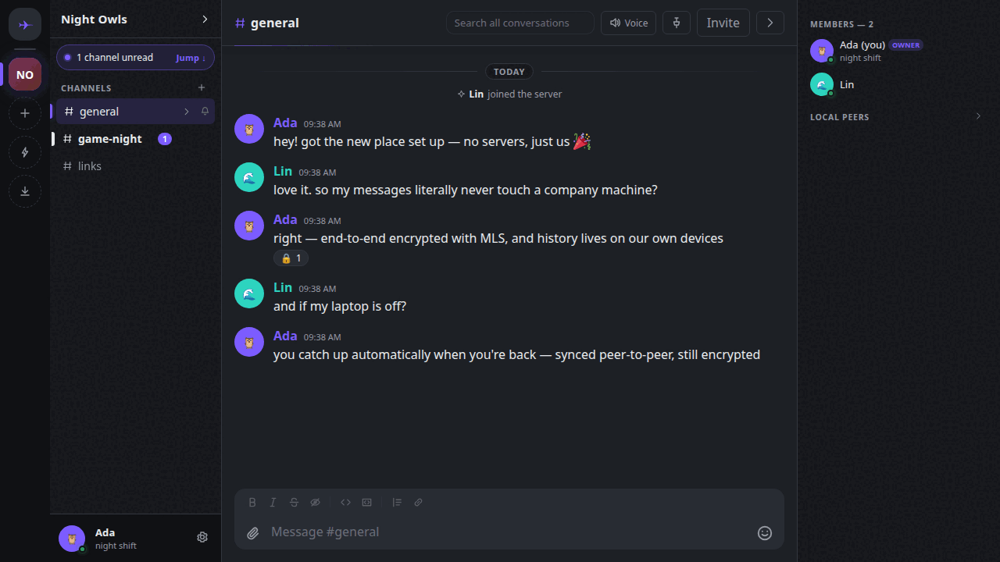
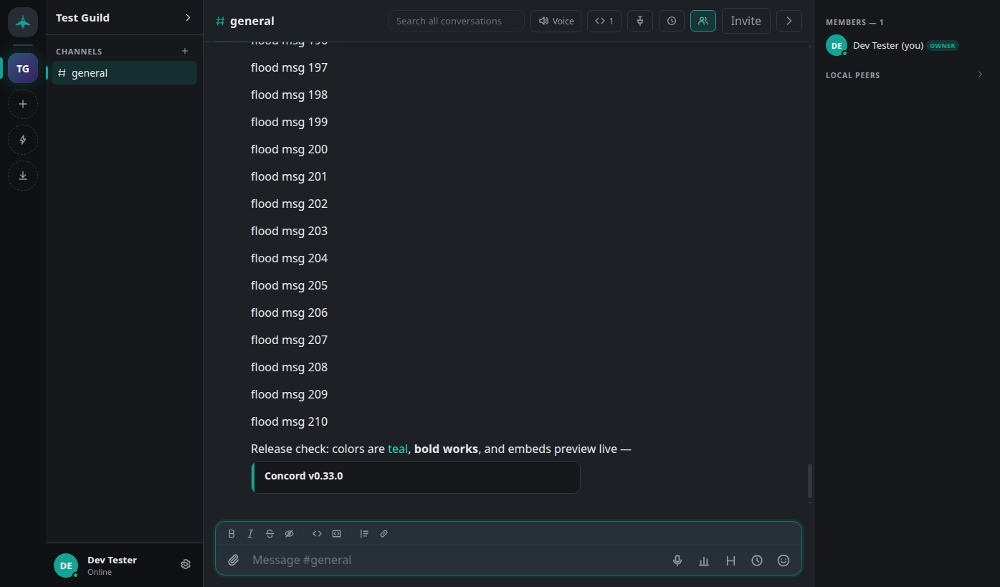
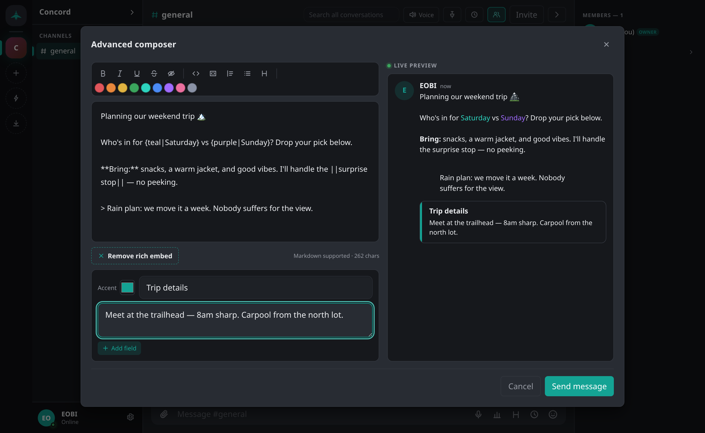

# ◆ Concord

**A serverless, end-to-end-encrypted Discord alternative — your community, on your machines, readable by no one else.**



> *Two peers on one machine (isolated dev instances) chatting over a real guild:
> channels, an MLS-encrypted conversation, and the safety-number verification
> that defeats impersonation. No server sits between them.*

Concord is a peer-to-peer group chat and voice application written in Go with a
Svelte front end. There is no company, no account database, and no server that
stores your messages. Every guild ("server") is a cryptographic group; every
message is end-to-end encrypted; every byte of infrastructure it *can* use is
untrusted by construction.

This document is both the manual and the architecture paper: it explains what
peer-to-peer actually means, how every layer of Concord works, and why the
design is more private than a centralized platform can ever be. For the short,
plain-language version of what data exists and who can read it, see
**[PRIVACY.md](PRIVACY.md)**.

### A quick look

| | |
|---|---|
|  |  |
| *Colored text and an author-built rich embed, in the feed* | *The advanced composer — colours, a rich-embed builder, and a live preview* |

---

## Table of contents

1. [Why Concord exists](#1-why-concord-exists)
2. [Peer-to-peer, from first principles](#2-peer-to-peer-from-first-principles)
3. [The architecture at a glance](#3-the-architecture-at-a-glance)
4. [Layer 1 — Identity: your keypair is your account](#4-layer-1--identity-your-keypair-is-your-account)
5. [Layer 2 — The network: finding and reaching peers](#5-layer-2--the-network-finding-and-reaching-peers)
6. [Layer 3 — Group encryption: MLS and the ratchet](#6-layer-3--group-encryption-mls-and-the-ratchet)
7. [The life of a message](#7-the-life-of-a-message)
8. [Message actions: edits, deletes, reactions, pins](#8-message-actions-edits-deletes-reactions-pins)
9. [Voice: a browser-to-browser encrypted mesh](#9-voice-a-browser-to-browser-encrypted-mesh)
10. [Storage: encrypted at rest, searchable locally](#10-storage-encrypted-at-rest-searchable-locally)
11. [History sync: catching up after being offline](#11-history-sync-catching-up-after-being-offline)
12. [Infrastructure: the untrusted rendezvous node](#12-infrastructure-the-untrusted-rendezvous-node)
13. [Threat model — what Concord defends against](#13-threat-model--what-concord-defends-against)
14. [Concord vs. a centralized platform](#14-concord-vs-a-centralized-platform)
15. [Running Concord](#15-running-concord)
16. [Playing with friends over the internet](#16-playing-with-friends-over-the-internet)
17. [Engineering notes](#17-engineering-notes)
18. [Feature status & roadmap](#18-feature-status--roadmap)

---

## 1. Why Concord exists

Centralized chat platforms have a structural property that no policy can fix:
**the operator sits between every message you send and every friend who reads
it.** The operator authenticates you, stores your history, relays your voice,
and — even with the best intentions — *can* read, mine, moderate, lose, leak,
or be compelled to hand over all of it. You don't own your community; you rent
it.

Concord inverts the model. The design goals, in order:

1. **Security first** — end-to-end encryption for everything: messages, voice,
   history at rest. Not as a feature, but as the load-bearing structure.
2. **Peer-to-peer** — peers talk to each other. Any helper infrastructure is
   *untrusted*: useful for routing, cryptographically incapable of reading.
3. **Simple by discipline** — Concord holds to the Unix philosophy: do the chat
   job well, and stay small. A layered Go core (~15k lines of product code),
   pure-Go dependencies (no C toolchain), **one binary that works fully on its
   own** — it needs no other product, cloud, service, or account to function. It
   is *deeply customizable* — themes, profiles, layout, message styling — but
   customizable is not the same as bloated: every option serves the one job, and
   nothing bolts a second product onto the first.
4. **Actually pleasant** — Discord-grade UX: guilds, channels, replies,
   reactions, pins, profiles, voice with speaking indicators, search.

**On bloat.** Simplicity is a pillar, not a nicety — it is what keeps the
security model auditable and the whole app one reviewable thing. Bloat is easy
to miss because it arrives *wearing the clothes of a feature*: an AI assistant,
a "shared brain," a bus for other apps to plug into.

The line used to be drawn at *coupling* — depend on no cloud, no account, no
sibling product — which left room for "optional, local, off by default" helpers
that shell out to something you install yourself. Searching the text inside your
own screenshots was the example, backed by a local OCR engine. It was written,
removed, written again, and removed again, which is the useful part of the story:
the line was in the wrong place. "Optional" and "local" did not stop it being a
thing a user has to install, a second program to keep working, and a paragraph in
the docs explaining why the feature is missing on their machine. A dependency
you can decline is still a dependency.

So the line is now simply: **if it isn't in the binary, it isn't in Concord.**
Whatever ships must work on a fresh machine with nothing else installed.

The deliberate trade-off: Concord targets **friend groups and communities**,
not million-user servers. A full mesh of peers doesn't scale to stadiums — and
doesn't need to.

---

## 2. Peer-to-peer, from first principles

### The client–server model (Discord, Slack, …)

In a centralized system, nobody talks to each other — everybody talks to the
middleman:

```
        alice ──────┐                  ┌────── carol
                    ▼                  ▼
               ┌─────────────────────────────┐
               │       COMPANY SERVER        │
               │  • authenticates everyone   │
               │  • stores every message     │
               │  • relays every voice call  │
               │  • sees EVERYTHING          │
               └─────────────────────────────┘
                    ▲                  ▲
        bob ────────┘                  └────── dave
```

Even when such a platform encrypts traffic "in transit" (TLS), the server
terminates that encryption: the plaintext exists on the operator's machines.
Every property of your community — availability, privacy, history, membership —
is a promise the operator makes, not a guarantee you hold.

### The peer-to-peer model (Concord)

In a P2P system, the participants *are* the system. Each person runs a node;
nodes connect directly to each other:

```
        alice ◄════════════════► carol
          ▲  ╲                 ╱  ▲
          ║   ╲               ╱   ║        every line is a direct,
          ║    ╲             ╱    ║        Noise-encrypted connection
          ║     ╲           ╱     ║        between two peers
          ▼      ╲         ╱      ▼
         bob ◄════╲═══════╱═══► dave
```

Three hard problems immediately appear, and the rest of this document is
essentially the story of how Concord solves each one:

| Problem | Naive difficulty | Concord's answer |
|---|---|---|
| **Discovery** — how does alice *find* bob's address? | Peers have no stable public address. | mDNS on a LAN; a DHT "phone book" + rendezvous node across the internet (§5). |
| **NAT traversal** — home routers block unsolicited inbound traffic. | Two NAT'd peers can't just connect. | Hole punching (DCUtR); an untrusted relay as fallback (§5). |
| **Trust** — with no server vouching, who is "bob"? | Anyone could claim to be anyone. | Identities are keypairs; a fingerprint you verify once (§4). |
| **Encryption** — no server means no server-side gatekeeper *or* guarantee. | You must encrypt for the *group*, yourself. | MLS group encryption with forward secrecy (§6). |

### Why "peer-to-peer" is worth the difficulty

Because solving those problems yourself means **nobody else has to be trusted**.
There is no machine in the middle that authenticates you, stores your messages,
or relays your calls in the clear. Privacy stops being a policy the operator
promises and becomes a property of the math.

Analogy: client–server is mailing every letter through one post office that
photocopies each page "for safety." Peer-to-peer is handing your friend a sealed,
tamper-evident envelope that only they can open — and there is no post office.

---

## 3. The architecture at a glance

The whole system on one page. Solid lines are direct peer-to-peer; the dashed
box is the *only* infrastructure, and it is untrusted.

```
   ┌──────────────────────────┐                ┌──────────────────────────┐
   │      Alice's device      │                │      Bob's device        │
   │                          │                │                          │
   │  Svelte UI (browser or   │                │  Svelte UI (native/web)  │
   │  native Wails window)    │                │                          │
   │        │  bridge         │                │        │  bridge         │
   │  ┌─────▼──────────────┐  │   end-to-end   │  ┌─────▼──────────────┐  │
   │  │  Service (app)     │  │   encrypted    │  │  Service (app)     │  │
   │  │  MLS group crypto  │◄─┼── ciphertext ──┼─►│  MLS group crypto  │  │
   │  │  encrypted SQLite  │  │  over libp2p   │  │  encrypted SQLite  │  │
   │  │  libp2p host       │  │  (gossipsub,   │  │  libp2p host       │  │
   │  └────────────────────┘  │   streams,     │  └────────────────────┘  │
   │   Ed25519 identity 🔑    │   WebRTC)      │   Ed25519 identity 🔑    │
   └───────────┬──────────────┘                └──────────────┬───────────┘
               │                                              │
               │      ┌─ ─ ─ ─ ─ ─ ─ ─ ─ ─ ─ ─ ─ ─ ─ ┐      │
               └──────┤   rendezvous / relay node      ├──────┘
        used only to  │   • DHT (a shared phone book)  │  never sees plaintext
        find peers &  │   • Circuit Relay (dumb pipe)  │  or media — only opaque
        punch NATs    │   • self-hosted (e.g. fly.io)  │  ciphertext passes
                      └ ─ ─ ─ ─ ─ ─ ─ ─ ─ ─ ─ ─ ─ ─ ─ ┘
```

Concord is built in **strict layers**, each depending only on those below it, so
each concern can be reasoned about — and tested — in isolation:

```
  ┌─────────────────────────────────────────────────────────────┐
  │ 7 · UI            Svelte app (guilds, chat, voice, settings) │  frontend/
  ├─────────────────────────────────────────────────────────────┤
  │ 6 · App / API     Service orchestrates everything; a bridge  │  internal/app
  │                   exposes it to both front ends identically  │  bridge.go
  ├───────────────┬───────────────────────┬─────────────────────┤
  │ 3 · Domain    │ 5 · Storage           │ (media: browser)     │
  │ pure model:   │ encrypted SQLite      │ WebRTC audio mesh    │  internal/domain
  │ guilds,       │ (sealed at rest;      │ — Go relays only     │  internal/store
  │ channels, msgs│  local search)        │   signaling          │
  ├───────────────┴───────────────────────┴─────────────────────┤
  │ 2 · Network       libp2p host · mDNS/DHT discovery ·          │  internal/net
  │                   gossipsub pub/sub · request streams         │
  ├─────────────────────────────────────────────────────────────┤
  │ 1 · Crypto/ID     Ed25519 identity · MLS group encryption ·   │  internal/identity
  │                   at-rest encryption                          │  internal/crypto/mls
  └─────────────────────────────────────────────────────────────┘
```

The building blocks, in plain terms:

| Concept | What it is | Concord's choice |
|---|---|---|
| **libp2p** | A P2P networking toolkit: identity, transports, discovery, encryption, pub/sub — batteries included. | `go-libp2p` v0.48 |
| **Transport encryption** | Encrypts each hop between two connected peers. | **Noise** (same as WireGuard), over TCP + QUIC |
| **gossipsub** | Publish/subscribe: peers subscribe to a topic; messages flood efficiently across the subscriber mesh. | `go-libp2p-pubsub` |
| **MLS** | *Messaging Layer Security* (RFC 9420): the modern standard for **group** E2E encryption with forward secrecy. | `mls-go` v1.5, cipher suite CS1 |
| **DHT** | *Distributed Hash Table*: a decentralized "phone book" spread across nodes. | `go-libp2p-kad-dht` (Kademlia) |
| **WebRTC** | Browser-native real-time audio with its own encryption (DTLS-SRTP). | Runs in the UI; Go relays signaling only |

---

## 4. Layer 1 — Identity: your keypair is your account

There is no signup, no email, no username table. On first run, Concord generates
an **Ed25519 keypair** (a modern elliptic-curve signature scheme):

```
   32 random bytes (seed)
          │
          ▼  ed25519
   ┌──────────────┐         ┌───────────────────────────┐
   │ private key  │────────►│ public key (shareable)    │
   │ (never leaves│  derive │  ├─► libp2p PeerID         │  ← your network address
   │  the device) │         │  └─► fingerprint           │  ← your "safety number"
   └──────────────┘         └───────────────────────────┘
          │
          ▼   sign anything → unforgeable proof it came from you
```

- **Your public key is your account.** Your network address (libp2p *PeerID*) is
  *derived* from it, so your address is cryptographically bound to your
  identity — nobody can occupy your address without your private key.
- **Your fingerprint** is a short readable hash of your public key
  (`base32(SHA-256(pubkey)[:20])`, shown as `2XXL XRW4 TT5D …`). Friends read it
  aloud once to confirm they hold each other's *real* key, defeating a
  man-in-the-middle who tries to substitute their own. (Signal calls this a
  "safety number.") In-app: the `verify` action marks a contact as confirmed.
- **The private key is encrypted at rest.** The 32-byte seed is sealed with
  **NaCl secretbox** (XSalsa20-Poly1305) under a key stretched from your
  passphrase by **Argon2id** (~64 MiB memory-hard, so guessing your passphrase is
  costly). The plaintext seed never touches disk.

> **Code:** `internal/identity/`. Tests verify the seed never appears in the
> keystore file and that a wrong passphrase fails closed.

---

## 5. Layer 2 — The network: finding and reaching peers

This layer exists to solve §2's hard problems. Concord uses a three-tier
strategy, escalating only as needed.

### Tier 1 — same network (mDNS)

On the same Wi-Fi/LAN, a device broadcasts "any Concord peers here?" via **mDNS**
(multicast DNS) and connects to whoever answers. Zero configuration.

```
        Your Wi-Fi
   ┌───────────────────────┐
   │  Alice ◄────► Bob      │   mDNS broadcast → instant direct connection,
   │   (direct, no internet)│   no servers involved at all.
   └───────────────────────┘
```

### Tier 2 — different networks (DHT + hole punching)

Across the internet, peers bootstrap off a **rendezvous node** and register in a
**DHT** — a decentralized phone book. Both advertise under the same Concord
rendezvous key and thus discover each other's addresses. Then libp2p performs
**hole punching** (DCUtR) so the two NAT'd peers connect *directly*:

```
   The NAT problem:                  Hole punching:

   Alice ─►│NAT│  ✗  │NAT│◄─ Bob     1. Both learn each other's public
           router    router             address via the rendezvous node.
    (routers block unsolicited       2. Both send packets AT THE SAME TIME.
     inbound; neither can connect)   3. Each router, having just seen an
                                        OUTBOUND packet, now permits the
                                        matching INBOUND one → a hole is
                                        punched → a DIRECT link forms.

   Result:  Alice ◄═════════════════► Bob   (direct, full speed, no relay)
```

The rendezvous node only *coordinated* this; the actual traffic is peer-to-peer.

### Tier 3 — strict-NAT fallback (relay)

Some routers refuse to be punched. libp2p **AutoRelay** then routes packets
*through* the rendezvous node via **Circuit Relay v2**:

```
   Alice ─►│strict│      │strict│◄─ Bob    direct impossible
             NAT             NAT
                    │  relay  │
   Alice ──────────►│  node   │──────────► Bob    forwards packets that are
                    └─────────┘                   ALREADY end-to-end encrypted
                     sees only ciphertext         → the relay learns nothing
```

The relay is **untrusted** by construction: it is never a group member and never
a transport endpoint, so everything it forwards is opaque ciphertext.

> **Code:** `internal/net/{host,discovery,dht}.go`.

---

## 6. Layer 3 — Group encryption: MLS and the ratchet

Encrypting a 1:1 chat is easy. Encrypting a **group** where members join and
leave, asynchronously, with *no trusted server* to coordinate keys — is hard.
**MLS (RFC 9420)**, the IETF standard now shipping in Apple/Google Messages,
solves exactly this. In Concord, **every guild is an MLS group.**

```
   Guild "gamers"  ══  one MLS group (shared, secret group key per "epoch")
     ├── #general  ══  gossipsub topic   (messages sealed with the group key)
     ├── #memes    ══  gossipsub topic
     └── control   ══  gossipsub topic   (membership changes / "commits")
```

### The ratchet — why MLS is special

The group key **ratchets forward**: it continuously evolves, and every membership
change re-keys the entire group.

```
     epoch 0            epoch 1              epoch 2
   ┌─────────┐  Bob   ┌─────────┐  Carol   ┌─────────┐
   │ key K0  │ joins  │ key K1  │  joins   │ key K2  │  …
   └─────────┘ ─────► └─────────┘ ───────► └─────────┘

   ▶ Forward secrecy       — stealing K2 does NOT reveal traffic sealed w/ K0,K1.
   ▶ Post-compromise sec.  — a removed member (new epoch) can't read new traffic.
```

- **Forward secrecy:** compromise your device *today* and yesterday's messages
  stay safe — the keys that sealed them have ratcheted away and been deleted.
- **Post-compromise security:** an attacker who briefly compromised a member but
  is then locked out (rekey/removal) loses access to *future* messages. The group
  heals. Discord and most chat apps have *neither* property.

### A clean engineering win

Concord's cipher suite is **CS1** (`MLS_128_DHKEMX25519_AES128GCM_SHA256_Ed25519`)
— Ed25519-based, matching Concord identities. So the MLS signing key is
**deterministically derived from your identity** (`HKDF(seed,
"concord-mls-sig-v1")`, separate from your libp2p key). Because it's reproducible
from your seed, a **restarted device re-derives the same key and keeps sending**
— no key backup needed. (This took a tiny, isolated patch to the MLS library to
*supply* the signing key rather than let it generate a random one; it adds no
crypto logic, and the library's RFC 9420 interop vectors still pass.)

> **Code:** `internal/crypto/mls/`, patch in
> `third_party/mls-go/client_concord_ed25519.go`.

---

## 7. The life of a message

Following "hello" from Alice's keyboard to Bob's screen ties every layer
together:

```
  ALICE                                                        BOB
  ─────                                                        ───
  types "hello" in #general
     │
     ▼
  ① wrap as a Message {id, sender, content, time, …}
     │
     ▼
  ② MLS.Encrypt(guild group)  → ciphertext only members' keys can open
     │
     ▼
  ③ gossipsub.Publish(topic = hash(guildID, channelID), ciphertext)
     │        ═════════ peer-to-peer over libp2p (Noise transport) ═════════
     ▼                                                    │
  ④ store locally (SQLite,                                ▼
     body encrypted at rest)              ⑤ gossipsub delivers ciphertext
                                                          │
                                                          ▼
                                    ⑥ MLS.Decrypt → "hello" + authenticated
                                       proof that Alice sent it
                                                          │
                                                          ▼
                                    ⑦ store locally + render in the UI
```

Two things worth underlining:

- **Encrypted twice, for two reasons:** MLS end-to-end (only members can read,
  even through a relay) *and* the Noise transport (each hop encrypted). The
  rendezvous/relay is neither a member nor a hop endpoint, so it sees only bytes.
- **Topics are hashes, not labels:** `concord/c/ + hex(SHA-256(groupID ‖
  channelID))`. The pub/sub network can't tell which guild or channel a message
  belongs to.

> **Code:** `internal/app/guild.go`, `internal/net/pubsub.go`,
> `internal/domain/model.go`.

---

## 8. Message actions: edits, deletes, reactions, pins

Edits, deletes, reactions, and pins ride the *same* encrypted channel as normal
messages — they're just messages with a `kind`:

```
   normal   → stored & displayed
   edit     → replaces content of the target (author-only, store-enforced) + "edited"
   delete   → tombstones the target (author-only) → "message deleted"
   reaction → toggles an emoji on the target, aggregated per-emoji
   pin      → flips the target's pinned flag (any member)
```

Each action names a target message ID, is MLS-encrypted and authenticated, and
re-emits the updated message so every peer converges. Authorization (only the
author may edit/delete) is enforced in the store by matching the original
sender's key. Because storage is idempotent by message ID, replays are harmless.

> **Code:** `internal/app/guild.go` (`applyEdit`/`applyDelete`/`applyReaction`/
> `applyPin`), `internal/store/store.go`. Author-only authorization and
> reaction toggle/aggregate are unit-tested.

---

## 9. Voice: a browser-to-browser encrypted mesh

Text is small and delay-tolerant; audio is large and real-time — so voice takes a
different path: **the browser does the media, Go does the matchmaking.**

```
   Alice browser  ══ WebRTC audio (Opus, DTLS-SRTP) ══►  Bob browser
        ▲                                                    ▲
        │  SDP / ICE "signaling" (how to connect)            │
        └──── relayed as opaque blobs over libp2p ───────────┘
              (Go never touches the audio itself)
```

- **Media** (your voice) flows browser-to-browser via WebRTC, which brings its
  own end-to-end encryption (**DTLS-SRTP**) and the Opus codec — no Go audio
  stack, and it works the same in web and native builds.
- **Signaling** (small "here's how to reach me" SDP/ICE blobs) is relayed
  peer-to-peer over a libp2p stream; presence rides gossipsub. The UI shows
  participants with a **green speaking ring** driven by live audio-level
  detection.
- Topology is a **full mesh** (everyone → everyone), which is why voice targets
  small rooms — the honest bandwidth ceiling of pure P2P. A future optional
  **SFU** (forwarding *encrypted* SFrame frames) can scale rooms without becoming
  trusted.
- **Quality is tuned, not left to the default.** Browsers negotiate Opus timidly
  (~32 kbit/s, mono, tuned for a bad phone line). Concord rewrites the Opus
  parameters in every offer/answer — fullband 48 kHz, in-band FEC on, DTX off,
  a configurable bitrate (64 kbit/s by default) — and raises the encoder's own
  ceiling on each sender, marking voice as high-priority traffic. A screen
  share's sound rides its own m-line in **stereo** at a higher rate, because
  music through a mono speech codec is what everyone notices.
- **Settings → Voice & Video** picks the microphone, speaker and camera, with a
  live level meter, a test tone and a camera preview; adds mic boost, a noise
  gate, a master call volume, and switches for the browser's echo cancellation /
  noise suppression / automatic gain. Everything applies to a call already in
  progress — devices swap with `replaceTrack`, so nothing renegotiates and
  nobody hears a gap.

> **Code:** `internal/app/voice.go`, `internal/net/signal.go`,
> `frontend/src/lib/voice.js`, `frontend/src/lib/devices.js`,
> `frontend/src/lib/sdp.js`.

---

## 10. Storage: encrypted at rest, searchable locally

Your history lives only on your own devices — there is no server copy. Locally
it's an **encrypted SQLite** database (pure-Go `modernc.org/sqlite`, no C
dependency):

- **Message bodies are sealed** with secretbox under `HKDF(seed,
  "concord-store-v1")`. A stolen database file yields no readable messages.
- **Search is local-only** — it scans your own history; the query never leaves
  your machine. A server-based app *structurally cannot* offer you that.
- **Export** dumps a channel to Markdown, because your data is yours.

> **Code:** `internal/store/store.go`. At-rest encryption and wrong-key failure
> are unit-tested.

---

## 11. History sync: catching up after being offline

With no server buffering messages, Concord adds **reconnect sync**: when peers
reconnect, each asks the other for messages it missed per channel (since its
latest timestamp). The catch-up batch is itself **MLS-encrypted to the group**,
so only members can serve or read it; saves are idempotent by message ID.

```
   Bob offline ──────────────────────►  Bob reconnects
      (misses messages)                     │
                                            ▼
                        "send me #general since <my latest timestamp>"
                                            │  ◄── batch, MLS-encrypted to group
                                            ▼
                        stores only what's new → UI fills in the gap
```

Trust note: synced messages are *attested by the serving member* (their local
copies), not re-verified per original sender — the trust you already place in
fellow guild members. Verified live: kill a peer, send while it's offline,
restart it → the missed messages arrive automatically.

> **Code:** `internal/app/sync.go`, `internal/net/sync.go`.

---

## 12. Infrastructure: the untrusted rendezvous node

The one optional piece of infrastructure is ~100 lines: a libp2p host running the
**DHT in server mode** (storing the phone-book entries) plus the **Circuit Relay
v2** service. It is stateless regarding your data, identified by a stable key so
its address is predictable, and deployable to a tiny always-on host. It only ever
sees ciphertext.

> **Code:** `cmd/rendezvous/main.go`, `infra/rendezvous/` (Dockerfile + fly.toml).

---

## 13. Threat model — what Concord defends against

Security claims are only meaningful against a stated adversary.

**✅ Defends against:**

| Adversary | Why they fail |
|---|---|
| Network eavesdropper (Wi-Fi, ISP) | Every hop is Noise/DTLS-encrypted; payloads are MLS/SRTP-encrypted — they see ciphertext. |
| Malicious/compromised rendezvous or relay | Never a member, never a transport endpoint — forwards only ciphertext. |
| "Hack the server" | There is no central store to breach, subpoena, or leak. |
| Stolen device database | Message bodies and identity key are encrypted at rest (Argon2id + secretbox). |
| Message forgery | Every message is MLS-signed; the sender is authenticated. |
| Impersonation / MITM on first contact | Out-of-band fingerprint ("safety number") verification. |
| Retroactive decryption after a key leak | Forward secrecy — past epochs' keys are deleted. |
| A removed member reading new messages | Post-compromise security — removal re-keys the group. |

**❌ Explicit non-goals (stated honestly):**

| Not protected | Why / mitigation |
|---|---|
| Metadata privacy | The DHT/relay can observe *that* peers connect and roughly when (not content). Onion-routed discovery is future work. |
| Anonymity | Concord authenticates identities; it doesn't hide them. |
| History-sync authenticity | Offline-missed messages are attested by the serving member, not re-verified per sender. |
| A malicious member you invited | Concord protects the group's secrets from *outsiders*; it can't stop an insider screenshotting. |
| Public-scale spam/abuse | A friend-group tool, not a public platform. |

---

## 14. Concord vs. a centralized platform

| Property | Discord | **Concord** |
|---|---|---|
| Who can read your messages | The operator (plaintext to them) | **Only group members** (E2E via MLS) |
| Central point to hack/subpoena/ban | Yes | **None** (P2P; optional untrusted relay) |
| Forward secrecy / post-compromise security | No | **Yes** (MLS ratchet) |
| Where history lives | Their datacenter | **Your devices**, encrypted |
| Private full-text search | Server-side (they see queries) | **Local-only** |
| Data export / ownership | Limited | **One-click Markdown** |
| Identity | Account in their DB | **A keypair you own** |
| Self-hostable infra | No | **Yes** (~3 commands, untrusted) |
| Running cost | Their servers | **≈ free** (P2P + tiny relay) |
| **Cost of all that** | — | **Small rooms only** (home bandwidth) |

---

## 15. Running Concord

The same Svelte UI runs two ways, both driving the same Go core. Unlock with a
passphrase, then create/join guilds, chat, manage members, and verify contacts.

**Browser-served (no system dependencies — works anywhere Go does):**

```sh
cd frontend && npm install && npm run build && cd ..
go run .            # serves http://127.0.0.1:8787 — open it in a browser
```

**Local multi-peer testing** — spin up several isolated peers at once:

```sh
make peers          # 2 peers at :8801, :8802  (make peers N=3 for more)
make dev-clean      # remove local test data afterwards
```

They discover each other over mDNS. `make help` lists all targets.

**Native desktop (Wails)** — needs a system WebView:

```sh
sudo pacman -S --needed webkit2gtk-4.1     # Arch; or webkit2gtk (4.0)
make gui            # builds bin/concord-gui, then run it
```

`make gui` applies the right build tags (`wails desktop production webkit2_41`)
to select the native variant; a plain `go build`/`go run` builds the browser
variant.

### Tests

```sh
make test           # full suite (incl. a 3-node E2EE integration test)
make race           # same, under the race detector
```

---

## 16. Playing with friends over the internet

On the same Wi-Fi, peers find each other automatically — nothing to set up.
Across different networks, the flow is: **you set up once, your friend does
almost nothing.**

**Friend's entire experience (2 steps):**

1. Download one file (the release binary for their OS) and run it — the
   browser opens by itself.
2. Pick a passphrase, paste the invite code you sent, done.

The invite code carries *everything*: the guild, your addresses, **and your
rendezvous server** — the friend's app configures itself from the code alone.

**Your one-time setup:**

```sh
# 1. Host the rendezvous (free fly.io account; it only relays ciphertext):
fly launch --no-deploy -c fly.rendezvous.toml   # pick an app name
fly secrets set CONCORD_RELAY_SEED=$(openssl rand -hex 32) \
                CONCORD_PUBLIC_HOST=<your-app-name>.fly.dev
fly deploy -c fly.rendezvous.toml
fly logs        # copy the ">>> SHARE THIS ADDRESS <<<" line

# 2. Paste that address on YOUR login screen ("Connect with friends"), unlock.

# 3. Cut a release so friends have something to download (see below).
```

Then create a guild → **Invite** → send your friend (a) the release link and
(b) the invite code. That's it.

(A native mobile app — roadmap — will make this even more turnkey.)

### Cutting a release

**Releases are built LOCALLY and uploaded with `gh` — zero GitHub Actions
compute.** (CI-built releases used to burn paid macOS runner minutes at a 10×
multiplier on this private repo; the `release` workflow is now
`workflow_dispatch`-only for the rare case you want CI-built Windows/macOS
desktop apps and have billing headroom.)

```sh
git tag v0.9.0 && git push origin main v0.9.0   # version the source
scripts/publish-release.sh v0.9.0 notes.md      # build + publish to concord-dist
```

The script cross-compiles the web binaries for every OS, builds the native
Linux desktop app when webkit2gtk is installed, generates `SHA256SUMS`, and
creates the Release on the public dist repo. The app polls the dist repo's
releases unauthenticated for update checks, so the source stays private.

The dist-repo Release ends up with, with **no manual `gh release upload` step**:

- **Web binaries** (`dist-release/*`, built by `make release`) — one
  zero-dependency file per OS/arch; "download, run, browser opens."
- **Desktop apps** — `concord-desktop-linux` (bare binary),
  `concord-desktop-windows.exe`, and `concord-desktop-macos.zip` (the `.app`
  bundle zipped). Built in CI: Wails needs each OS's native WebView + cgo.
- `SHA256SUMS` (hashes of every asset) + `WINDOWS.md`.

The tag is stamped into every binary as `main.version` (via `-ldflags`), which is
what the in-app update check compares against `concord-dist`'s latest release.

**One-time setup for the public dist repo** (already done once; documented here):

1. Create the **public** repo `ZahakJ/concord-dist` (Releases only, no source).
2. Create a **fine-grained PAT**: owner `ZahakJ`, repository access = **only
   `concord-dist`**, permission **Contents: Read and write**. (If leaked it can
   only write the public dist repo — never read the private source.) Set an expiry
   + rotation reminder.
3. Add it to this repo as the Actions secret **`DIST_REPO_TOKEN`**.

**Windows false-positive submission (per release):** unsigned exes lose SmartScreen
reputation on every new build. After a release, submit
`concord-desktop-windows.exe` to
<https://www.microsoft.com/en-us/wdsi/filesubmission> (category: incorrectly
detected / false positive) to whitelist that build's hash in Defender. This must be
redone each release (new hash). The durable fix is code signing (deferred). See
`WINDOWS.md` for the user-facing bypass + the web-exe fallback.

Notes for future-you:

- **Never move a published tag.** Bump to a new `vX.Y.Z` instead — the desktop
  matrix and the web track key off the tag.
- Use **semver `vX.Y.Z`** tags: the update check only recognizes that shape
  (pre-release/`-rc` tags are treated as "no update").
- `make release` alone only builds the **web** binaries locally (handy for a
  quick smoke test); it does **not** produce the desktop apps or touch GitHub.
- The rendezvous node is deployed separately and rarely — `fly deploy -c
  fly.rendezvous.toml`. Keep `CONCORD_RELAY_SEED` stable forever; it's the
  node's identity and every invite code ever issued embeds its PeerID.

---

## 17. Engineering notes

- **~15k lines of product Go** (plus ~4k of tests) across a strict layer
  stack, plus a Svelte front end. Pure-Go dependencies (no C toolchain):
  `go-libp2p`, `go-libp2p-pubsub`, `go-libp2p-kad-dht`, `mls-go`,
  `modernc.org/sqlite`.
- **One core, two front ends.** A transport-agnostic `bridge` exposes the
  `Service` to both the browser build (HTTP + Server-Sent Events) and the native
  Wails window (runtime events) — identical behaviour.
- **Tested where it matters.** Identity, MLS group flows (ratchet, removal,
  outsider-exclusion), at-rest encryption, and message-action authorization are
  unit-tested; in-process multi-peer integration tests run under Go's race
  detector.
- **Vendored MLS** (`third_party/mls-go`) via a `replace` directive carries a
  single, isolated patch (deterministic signing key) that keeps the upstream
  RFC 9420 interop vectors passing.

Map of the code:

```
  internal/identity/    Ed25519 identity + Argon2id-encrypted keystore
  internal/crypto/mls/  MLS group-encryption engine (swappable Engine interface)
  internal/domain/      pure model: guilds, channels, messages, topic derivation
  internal/net/         libp2p host, mDNS+DHT discovery, gossipsub, and the
                        invite / signal / sync stream protocols
  internal/store/       encrypted SQLite: history, reactions, settings, search
  internal/app/         the Service — orchestrates everything; the shared API
  bridge.go             transport-agnostic bridge (Wails events OR web SSE)
  main_web.go           browser-served front end (HTTP + SSE)
  main_wails.go         native desktop window (Wails)
  frontend/             Svelte UI
  cmd/rendezvous/       the untrusted DHT + relay node
  third_party/mls-go/   vendored MLS library + the deterministic-key patch
```

---

## 18. Feature status & roadmap

**Done** — identity + encrypted keystore; libp2p transport with mDNS **and** DHT
discovery, relay, hole-punching; MLS-encrypted guilds/channels; replies, edits,
deletes, reactions, pins; markdown (code blocks, lists, quotes) with clickable
@mentions; **encrypted 5 MB image attachments** (fetched out-of-band, cached);
**native link previews + click-to-play YouTube embeds**; quick switcher (Ctrl+K)
and keyboard navigation; unread counts + per-channel mute; synthesized
voice/mention sounds; system join/create notices; live presence, typing, and
full profiles (avatar emoji, accent color, custom status, drag/paste + crop
avatar editor); voice mesh with a speaking-ring participant panel — plus
**camera video and screen sharing** with Discord-style focus/theater tiles;
guild rename; local full-history search; desktop notifications; Markdown
export; offline history sync; encrypted-at-rest storage; browser **and**
native desktop front ends; a self-hostable rendezvous/relay node; a **friends
list and end-to-end-encrypted 1:1 direct messages**, with an encrypted
**offline mailbox** on the rendezvous node (ciphertext-only deposits, optional
contentless push wakes) so DMs land even when the recipient is offline;
**channel categories and roles & permissions** (signed, replayable governance
log); **multi-device linking** (QR pair a phone/second desktop; device
certificates keep MLS identity intact); **native mobile apps** (Capacitor
Android + iOS shells over a gomobile core — Android APKs ship with releases);
and in-app **self-update**.

**Next** — an optional **SFU** (forwarding still-encrypted frames) for larger
voice rooms; onion-routed metadata privacy; and iOS distribution
(TestFlight/App Store) to match Android's turnkey install.

The single deliberate trade — peer count per room — buys privacy by
construction, data ownership, and independence from any operator.

---

## License

Concord is free and open-source software, licensed under the
**GNU Affero General Public License v3.0** (AGPL-3.0). See [LICENSE](LICENSE).

The AGPL is a deliberate choice for a privacy tool. You are free to use, study,
modify, and self-host Concord. But the AGPL closes the "SaaS loophole": if you
run a **modified** version as a network service that others interact with, you
must make your modified source available to those users. Nobody gets to take
Concord, quietly fork it into a closed hosted product, and deny their users the
freedoms you have here.

Copyright (C) 2026 Concord contributors.

    This program is free software: you can redistribute it and/or modify it
    under the terms of the GNU Affero General Public License as published by the
    Free Software Foundation, either version 3 of the License, or (at your
    option) any later version. This program is distributed WITHOUT ANY WARRANTY;
    without even the implied warranty of MERCHANTABILITY or FITNESS FOR A
    PARTICULAR PURPOSE. See the GNU AGPL for more details.
