<p align="center">
  <picture>
    <source media="(prefers-color-scheme: dark)" srcset="docs/media/banner.png">
    <source media="(prefers-color-scheme: light)" srcset="docs/media/banner-light.png">
    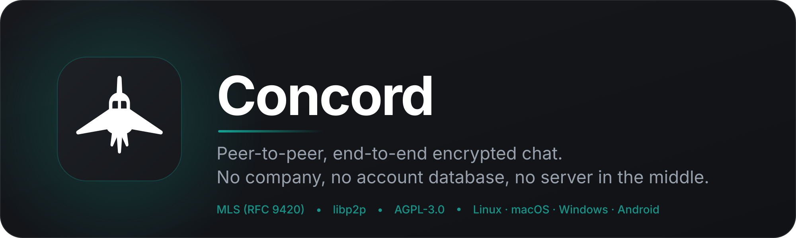
  </picture>
</p>

<p align="center">
  <a href="https://github.com/ZahakJ/concord/actions/workflows/ci.yml"></a>
  <a href="https://github.com/ZahakJ/concord/releases/latest"></a>
  <a href="LICENSE"></a>
</p>

Concord is peer-to-peer, end-to-end encrypted group chat: guilds, channels,
direct messages, voice, video and screen sharing. There is no account server
and no message store. Each guild is an MLS group (RFC 9420), and history lives
on the members' devices.

<p align="center">
  <picture>
    <source media="(prefers-color-scheme: dark)" srcset="docs/media/screens/hero-dark.webp">
    <source media="(prefers-color-scheme: light)" srcset="docs/media/screens/hero-light.webp">
    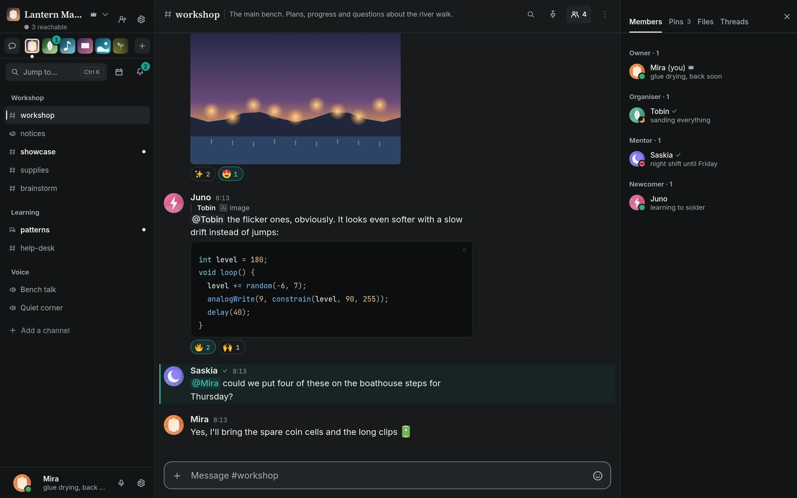
  </picture>
</p>

```sh
curl -fsSL https://zahakj.github.io/concord/install.sh | sh
```

That installs the single-file build for Linux or macOS into `~/.local/bin`
after checking it against the release's `SHA256SUMS`. Run `concord` and your
browser opens on the app. Windows, the native desktop apps and Android are on
the [releases page](https://github.com/ZahakJ/concord/releases/latest).

## What it looks like

<table>
<tr>
<td width="50%"><picture><source media="(prefers-color-scheme: light)" srcset="docs/media/screens/shelf-light.webp">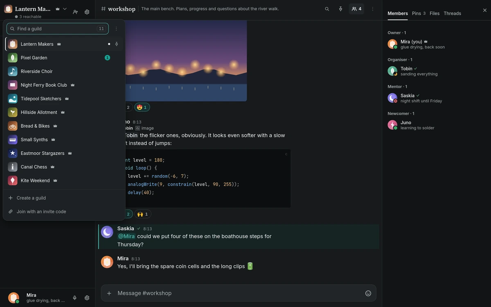</picture><br>Guilds sit in a row above the channel list. Click the guild's name to find any of them.</td>
<td width="50%"><picture><source media="(prefers-color-scheme: light)" srcset="docs/media/screens/appearance-light.webp">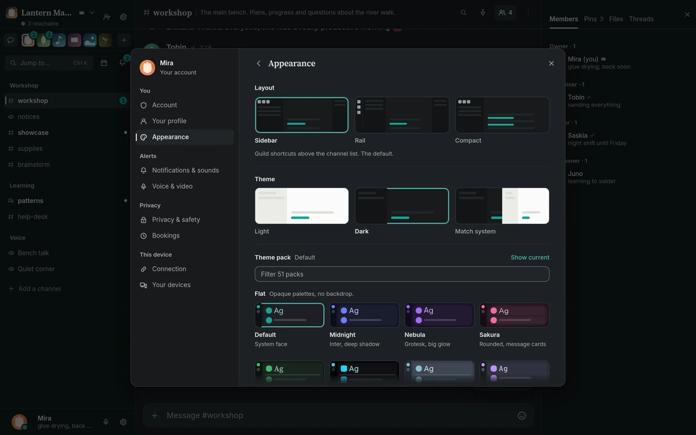</picture><br>Settings › Appearance › Layout: Sidebar, Rail or Compact.</td>
</tr>
<tr>
<td width="50%"><picture><source media="(prefers-color-scheme: light)" srcset="docs/media/screens/rail-light.webp">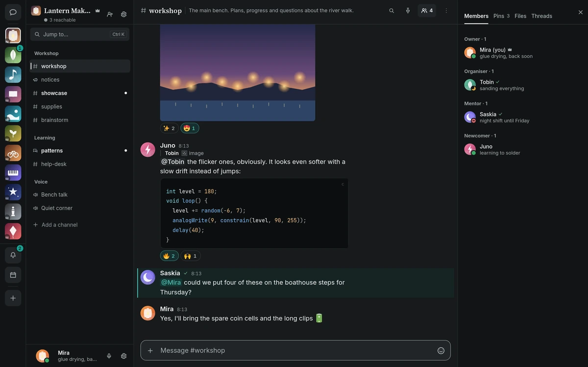</picture><br>The Rail layout keeps the guilds in a column.</td>
<td width="50%"><picture><source media="(prefers-color-scheme: light)" srcset="docs/media/screens/callfloat-light.webp">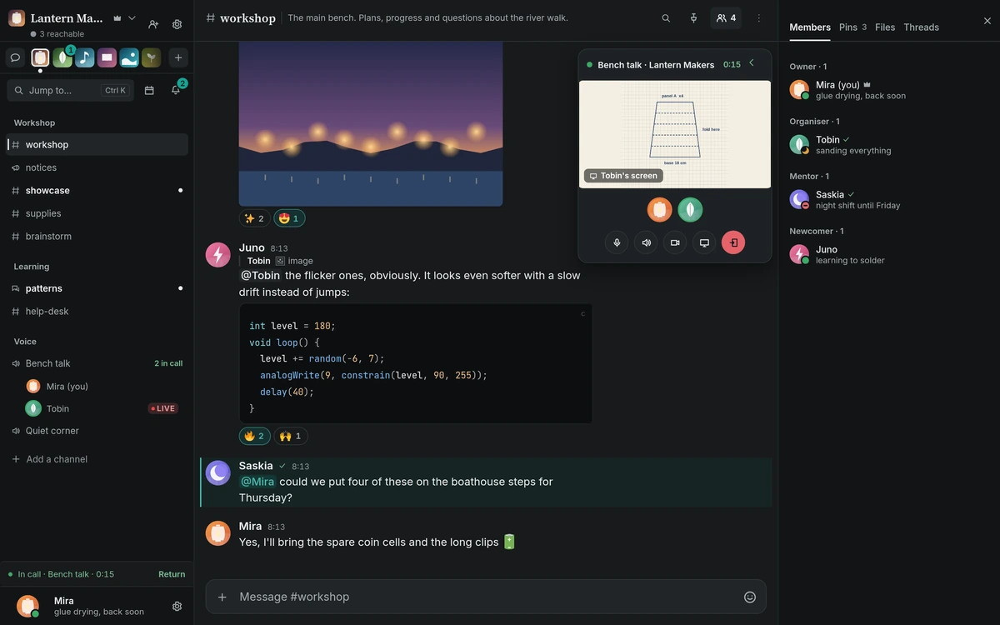</picture><br>Leave the call view and the call stays in a small window over any channel.</td>
</tr>
<tr>
<td width="50%"><picture><source media="(prefers-color-scheme: light)" srcset="docs/media/screens/callstage-light.webp">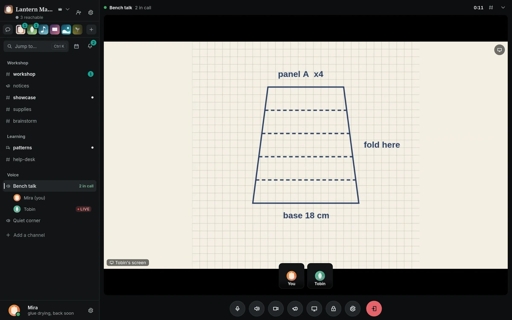</picture><br>A voice room with a shared screen, straight between devices.</td>
<td width="50%"><picture><source media="(prefers-color-scheme: light)" srcset="docs/media/screens/meeting-light.webp">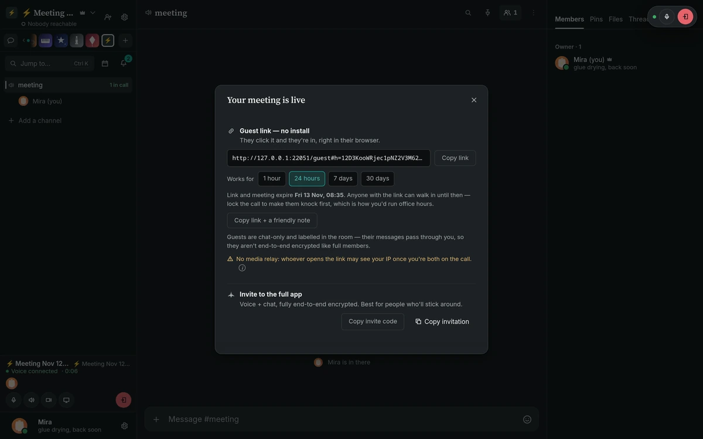</picture><br>Instant meeting: a guest link for people without the app.</td>
</tr>
<tr>
<td width="50%"><picture><source media="(prefers-color-scheme: light)" srcset="docs/media/screens/forum-light.webp">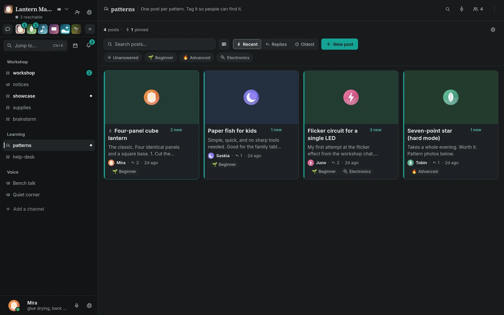</picture><br>Forum channels, here in the Gallery layout.</td>
<td width="50%"><picture><source media="(prefers-color-scheme: light)" srcset="docs/media/screens/thread-light.webp">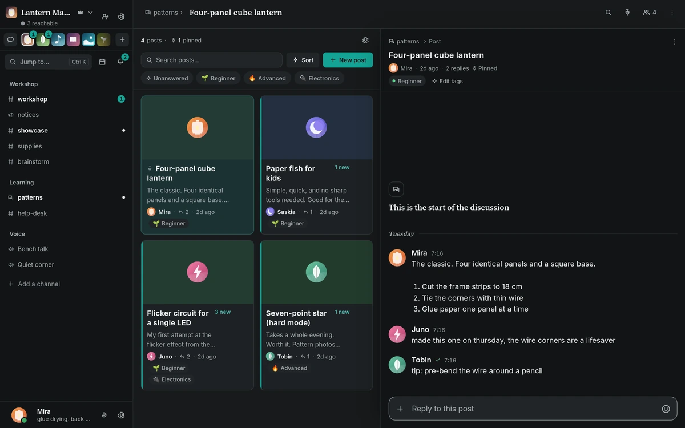</picture><br>A post opens beside its board.</td>
</tr>
<tr>
<td width="50%"><picture><source media="(prefers-color-scheme: light)" srcset="docs/media/screens/palette-light.webp">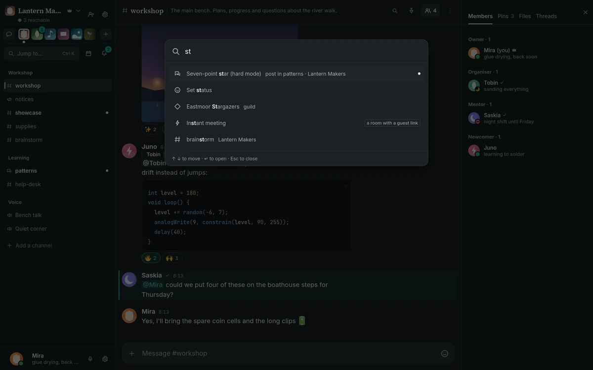</picture><br>Ctrl+K finds channels, posts, guilds, people and actions.</td>
<td width="50%">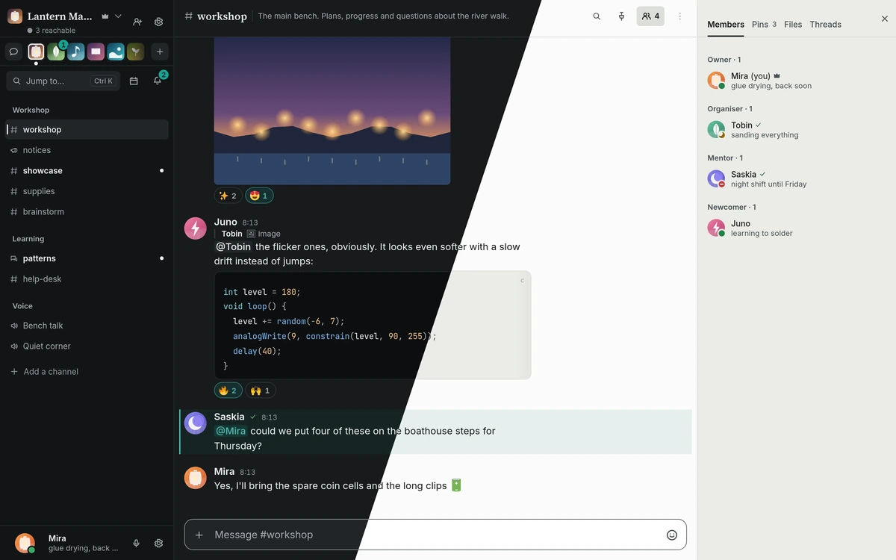<br>Light and dark, and theme packs on top.</td>
</tr>
</table>

On a phone, the same app with a tab bar:

<p align="center">
  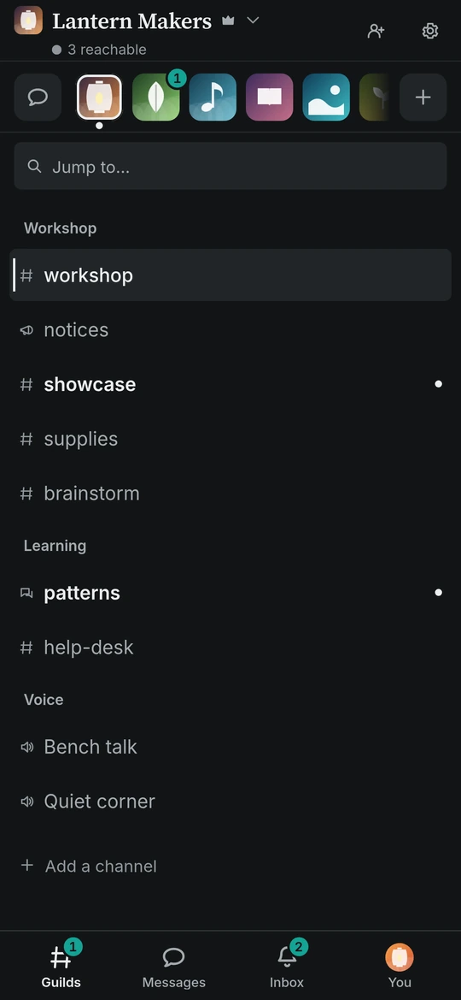
  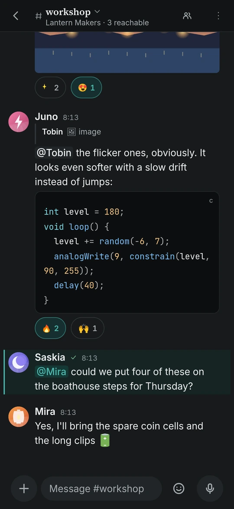
  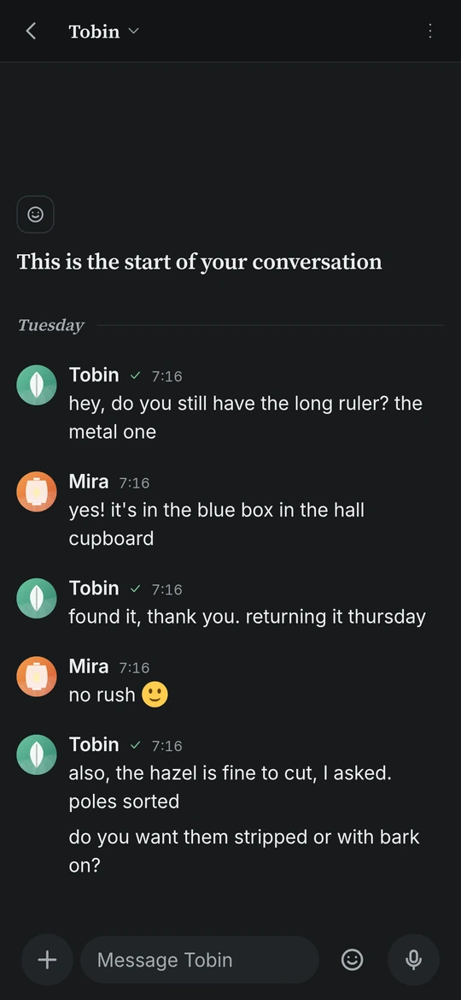
  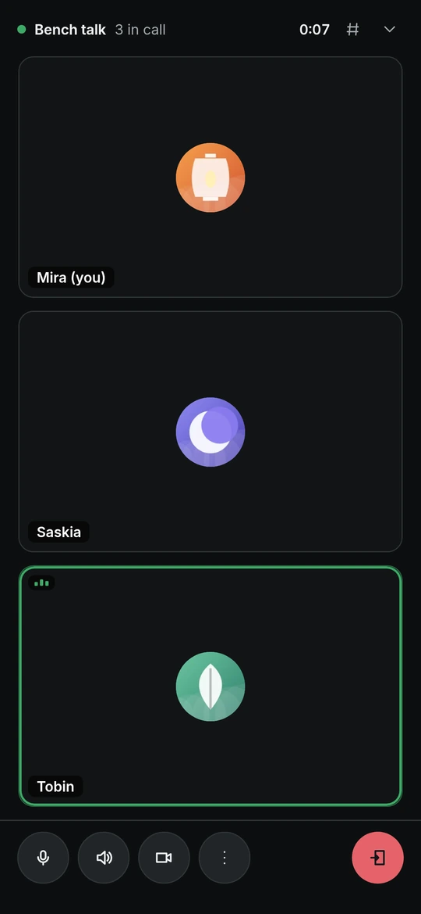
</p>

<p align="center">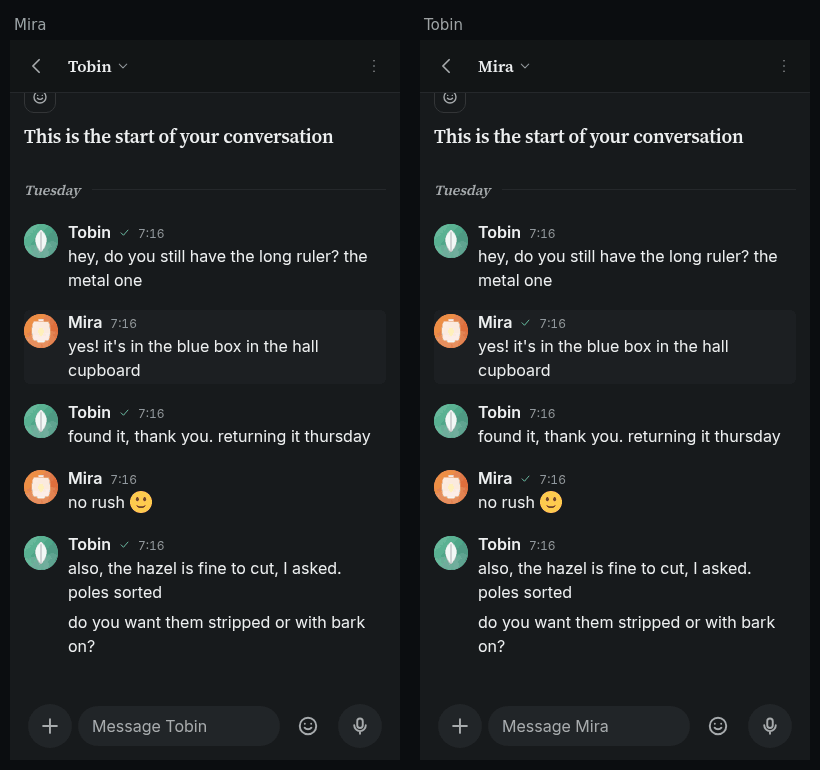</p>

## Using it

Pick a passphrase; the first unlock creates your identity, an Ed25519 keypair
stored on the device. Create a guild and send its invite code to a friend.

Two peers must be able to reach each other:

| Where you are | What it takes |
|---|---|
| Same Wi-Fi, or the same Tailscale/WireGuard mesh | Nothing. |
| One side can forward a port | One router rule. The invite code carries that address. |
| Neither can | Someone in the group runs a [rendezvous](docs/RENDEZVOUS.md): one small always-on node that introduces peers and relays ciphertext. |

**Can people reach me?** in the command palette (Ctrl+K) reports which row
you are in.

## Features

- Guilds with channels, categories, forums, roles and permissions
- Replies, edits, reactions, pins, mentions, polls, events, Markdown
- Direct messages, delivered through an encrypted offline mailbox when the
  recipient is away; message requests from strangers
- Voice, video and screen sharing over a WebRTC mesh; push-to-talk
- Meeting rooms that guests can join from a browser without installing
- Encrypted attachments, custom emoji, local full-text search, Markdown export
- Several devices per identity, linked by QR code
- Import of an exported community's history into a guild archive
- [Bots](docs/BOTS.md): a script with its own identity, speaking JSON lines
- Desktop apps for Linux and Windows, a browser-served build for Linux, macOS
  and Windows, and Android

Emoji, fonts, icons and sounds are compiled in. Nothing is fetched from a
third party unless you switch on a feature that says it will;
[PRIVACY.md](PRIVACY.md) lists every outbound request the app can make.

## Building

Go (version in `go.mod`) and Node 22+.

```sh
git clone https://github.com/ZahakJ/concord && cd concord
make web          # -> bin/concord-web, serves the UI on 127.0.0.1:8787
make gui          # native window, needs webkit2gtk-4.1
make peers        # two isolated local peers for development
make help         # everything else
```

## Documentation

The manual is at **[zahakj.github.io/concord/manual](https://zahakj.github.io/concord/manual/)**:
installing on each platform, guilds, calls, devices, backups, privacy,
moderation and troubleshooting, with developer pages on the architecture,
protocol, building and testing. Its sources are the Markdown in
[docs/manual](docs/manual) and [docs/dev](docs/dev); the documents below are
pages of it too.

| | |
|---|---|
| [DESIGN.md](docs/DESIGN.md) | How it works: identity, discovery, NAT traversal, MLS, sync, threat model |
| [RENDEZVOUS.md](docs/RENDEZVOUS.md) | Running the optional node |
| [BOTS.md](docs/BOTS.md) | Writing a bot |
| [PUSH.md](docs/PUSH.md) | Optional push wakes |
| [FAQ.md](docs/FAQ.md) | Common questions |
| [PRIVACY.md](PRIVACY.md) | What data exists and who can read it |
| [SECURITY.md](SECURITY.md) | Reporting a vulnerability; known gaps |
| [CONTRIBUTING.md](CONTRIBUTING.md) | Development loop, tests, code style |
| [RELEASING.md](docs/RELEASING.md) | Maintainer runbook |
| [WINDOWS.md](WINDOWS.md) | SmartScreen and Defender |
| [THIRD-PARTY-NOTICES.md](THIRD-PARTY-NOTICES.md) | Bundled assets and licences |

The optional meme-template pack is not in the repository; see
[frontend/public/memes/README.md](frontend/public/memes/README.md).

## Licence

GNU Affero General Public License, version 3 or later. See [LICENSE](LICENSE).
